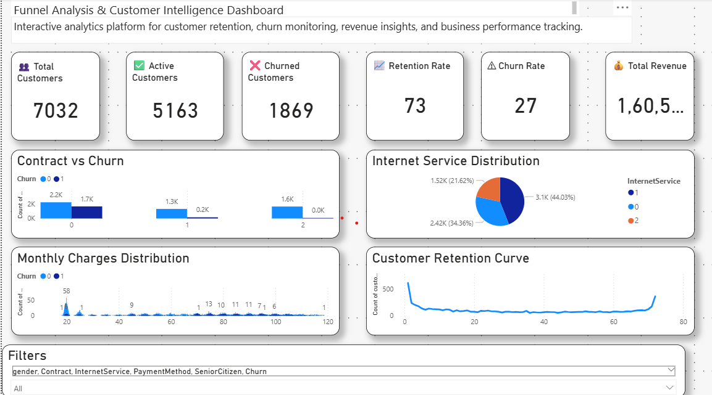
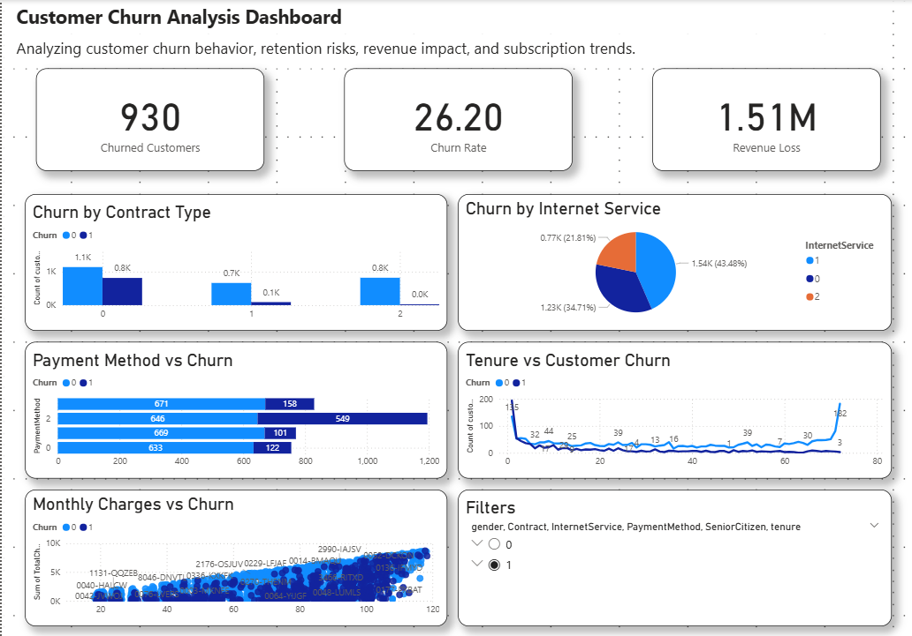
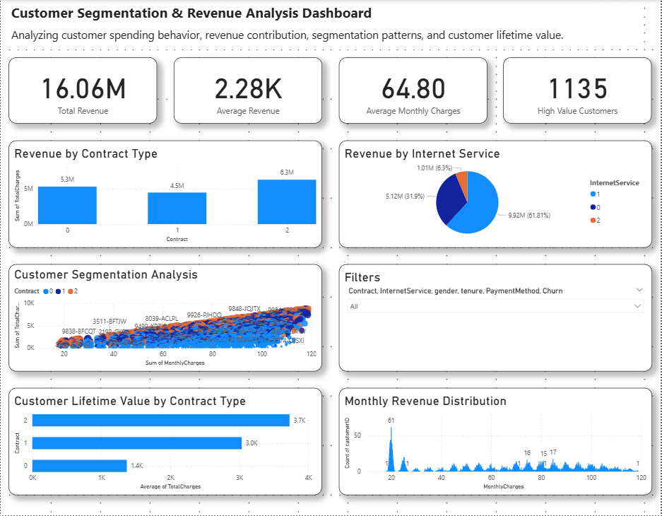
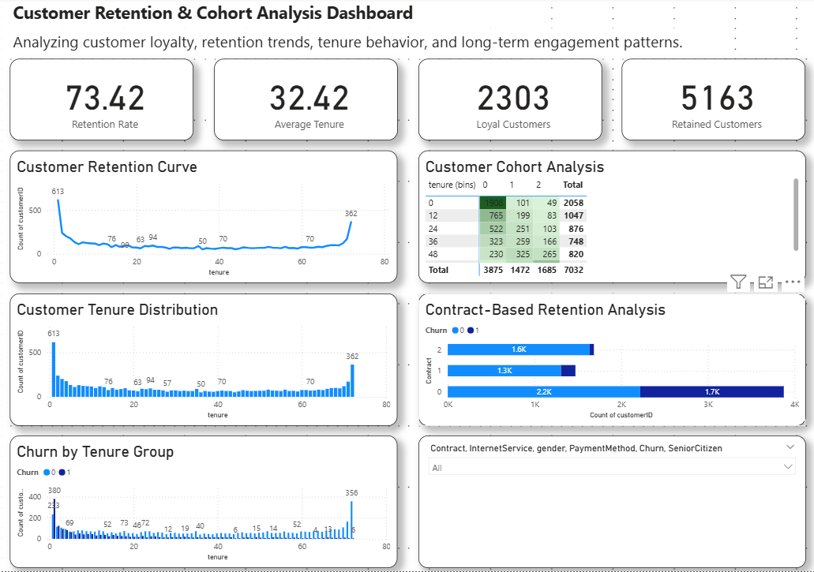
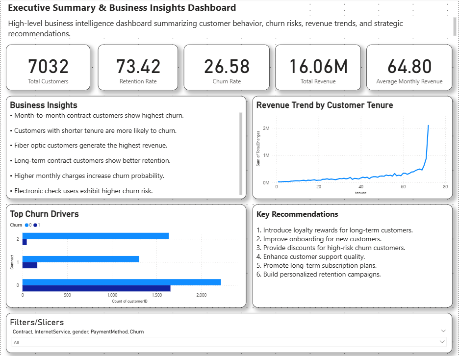

# 📊  Customer Retention Intelligence Platform

## 🚀 Live Demo

### Streamlit Application

🔗 Live App:

https://customer-retention-intelligence-platform-so9jqrreovwkbhehg65lo.streamlit.app/

---
## Overview

Customer Retention Intelligence Platform is an end-to-end analytics solution designed to help businesses identify churn risks, improve customer retention, analyze revenue performance, and support strategic decision-making through Business Intelligence dashboards and predictive analytics.

The platform combines:

- SQL Analytics
- Python Data Processing
- Machine Learning
- Power BI Dashboards
- Customer Segmentation
- Cohort Analysis
- Retention Analytics
- Executive Reporting

The system transforms raw customer data into actionable business insights that can reduce churn, improve retention, and maximize customer lifetime value.

---

# Business Problem

A telecom company with 7,032 customers was experiencing significant customer churn, resulting in revenue loss and reduced customer lifetime value.

Business stakeholders needed to:

- Identify major churn drivers
- Understand retention behavior
- Monitor customer revenue contribution
- Segment high-value customers
- Analyze contract performance
- Improve customer engagement
- Build proactive retention strategies

Without a centralized analytics platform, decision-making was reactive rather than data-driven.

---

# Business Objectives

The primary objectives were:

- Analyze customer churn patterns
- Monitor retention and loyalty metrics
- Identify high-risk customer segments
- Quantify revenue contribution
- Build churn prediction capabilities
- Develop executive dashboards
- Generate actionable business recommendations

---

# Key Business Results

| Metric | Value |
|----------|----------|
| Total Customers | 7,032 |
| Active Customers | 5,163 |
| Churned Customers | 1,869 |
| Retention Rate | 73.42% |
| Churn Rate | 26.58% |
| Total Revenue | ₹16.06M |
| Average Monthly Revenue | ₹64.80 |
| High Value Customers | 1,135 |
| Loyal Customers | 2,303 |

---
## Project Results

- Total Customers: 7,032
- Retention Rate: 73.42%
- Churn Rate: 26.58%
- Revenue Analysed: ₹16.06M
- High Value Customers: 1,135

---
# Business Impact

The platform enabled the business to:

- Detect customer churn risks earlier
- Identify contract types with highest churn
- Understand revenue contribution by customer segment
- Track retention performance across tenure groups
- Prioritize customer retention campaigns
- Improve strategic decision-making through executive dashboards

---
## Business Impact Report

A detailed executive report summarizing business objectives, analytical findings, revenue insights, churn drivers, and strategic recommendations.

📄 [View Business Impact Report](reports/Business_Impact_Report.pdf)

---
# Dataset Overview

The dataset contains telecom customer subscription information.

### Features

| Feature | Description |
|----------|-------------|
| customerID | Unique customer identifier |
| gender | Customer gender |
| SeniorCitizen | Senior citizen flag |
| Partner | Customer partner status |
| Dependents | Customer dependents |
| tenure | Subscription duration |
| PhoneService | Phone service availability |
| InternetService | Internet service type |
| Contract | Contract category |
| PaymentMethod | Payment method |
| MonthlyCharges | Monthly subscription fee |
| TotalCharges | Lifetime customer charges |
| Churn | Customer churn status |

---

# Project Architecture

```text
Raw Dataset
    │
    ▼
ETL Pipeline
    │
    ▼
Data Cleaning & Validation
    │
    ▼
Analytics Engine
    ├── KPI Monitoring
    ├── Customer Segmentation
    ├── Retention Analysis
    ├── Cohort Analysis
    ├── Churn Prediction
    └── Executive Reporting
            │
            ▼
Power BI Dashboard
Streamlit Dashboard
```

---

# Analytics Modules

## KPI Monitoring

Tracks:

- Total Customers
- Active Customers
- Churned Customers
- Revenue
- Retention Rate
- Churn Rate

---

## Customer Segmentation

Segments customers based on:

- Revenue contribution
- Contract type
- Monthly charges
- Customer lifetime value

Key Outcome:

- Identified 1,135 high-value customers

---

## Churn Analysis

Analyzes:

- Contract-based churn
- Payment method impact
- Internet service impact
- Tenure influence
- Monthly charge behavior

Key Finding:

Month-to-month customers exhibit significantly higher churn risk.

---

## Retention Analysis

Measures:

- Retention rate
- Customer loyalty
- Long-term engagement

Results:

- Retention Rate: 73.42%
- Loyal Customers: 2,303

---

## Cohort Analysis

Evaluates customer behavior across tenure groups to understand long-term retention patterns.

Business Benefits:

- Understand customer lifecycle
- Measure cohort performance
- Identify retention opportunities

---

## Customer Lifetime Value Analysis

Analyzes:

- Revenue contribution
- Contract profitability
- Customer value distribution

Key Finding:

Long-term contract customers generate higher lifetime value.

---

## Executive Summary Reporting

Automatically generates:

- KPI summaries
- Revenue insights
- Retention insights
- Churn insights
- Strategic recommendations

---

# Machine Learning

## Churn Prediction

Built a predictive analytics model to identify customers likely to churn.

Business Value:

- Early intervention
- Targeted retention campaigns
- Reduced customer attrition

---

# SQL Analytics

Implemented advanced SQL analytics using:

- GROUP BY
- CASE WHEN
- Aggregate Functions
- Window Functions
- Common Table Expressions (CTEs)
- Ranking Functions
- Joins

### SQL Modules

- churn_analysis.sql
- retention_analysis.sql
- cohort_analysis.sql
- revenue_analysis.sql
- kpi_monitoring.sql

---

# Power BI Dashboards

## Dashboard 1 – Executive KPI Dashboard

Tracks:

- Total Customers
- Active Customers
- Churned Customers
- Revenue
- Retention Rate
- Churn Rate



---

## Dashboard 2 – Customer Churn Analysis

Analyzes:

- Churn by Contract Type
- Payment Method Impact
- Internet Service Impact
- Revenue Loss
- Tenure vs Churn



---

## Dashboard 3 – Customer Segmentation & Revenue Analysis

Analyzes:

- Revenue Contribution
- High Value Customers
- Customer Lifetime Value
- Revenue by Contract
- Revenue by Service Type



---

## Dashboard 4 – Retention & Cohort Analysis

Tracks:

- Retention Rate
- Loyal Customers
- Cohort Behavior
- Tenure Analysis
- Retention Trends



---

## Dashboard 5 – Executive Business Insights

Provides:

- Business Findings
- Strategic Recommendations
- Revenue Trends
- Churn Drivers



---

# Key Business Insights

### Churn Insights

- Month-to-month contract customers show the highest churn.
- Customers with shorter tenure are more likely to churn.
- Electronic check users demonstrate higher churn risk.
- Higher monthly charges increase churn probability.

### Revenue Insights

- Fiber optic customers contribute the highest revenue.
- Long-term contracts generate higher customer lifetime value.
- High-value customers contribute a significant portion of revenue.

### Retention Insights

- Long-term contract customers show stronger retention.
- Loyal customers generate greater lifetime value.
- Early-stage customers require improved onboarding support.

---

# Strategic Recommendations

1. Introduce loyalty rewards for long-term customers.
2. Improve onboarding for new customers.
3. Offer retention discounts to high-risk customers.
4. Promote annual and long-term contracts.
5. Build personalized customer engagement campaigns.
6. Improve customer support experiences.
7. Develop proactive churn prevention strategies.

---

# Technology Stack

### Programming

- Python
- SQL

### Python Libraries

- Pandas
- NumPy
- Scikit-Learn
- Matplotlib
- Seaborn
- Plotly
- Streamlit

### Database

- MySQL

### Visualization

- Power BI
- Streamlit

### Development Tools

- GitHub
- Jupyter Notebook
- VS Code

---

# Project Structure

```text
customer-retention-intelligence-platform/

├── data/
├── sql/
├── src/
├── reports/
├── models/
├── streamlit_app/
├── assets/
│   └── screenshots/
├── main.py
├── generate_report.py
├── requirements.txt
└── README.md
```

---

# Future Enhancements

- Real-time analytics pipeline
- AWS deployment
- Predictive revenue forecasting
- Customer recommendation engine
- Automated retention campaign generation
- API integrations
- Real-time churn monitoring

---

# Author

Jagadeeswari S

Data Analyst | SQL | Python | Power BI | Customer Analytics | Business Intelligence

LinkedIn: [Add Link]

GitHub: [Add Link]
